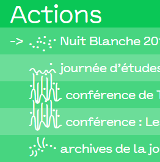
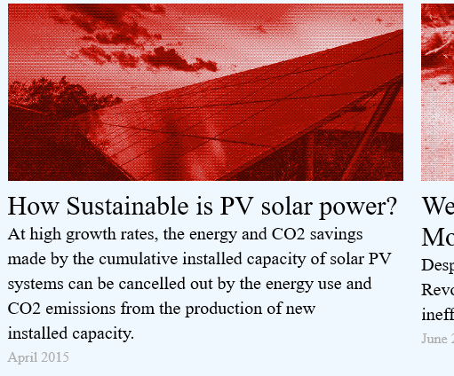
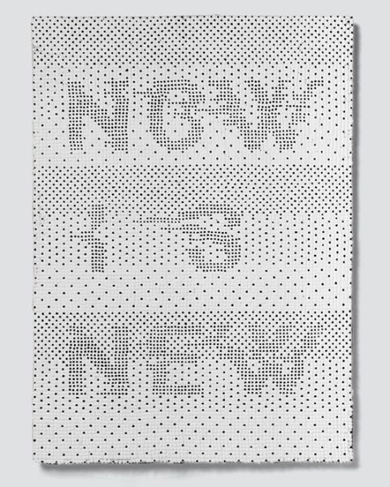
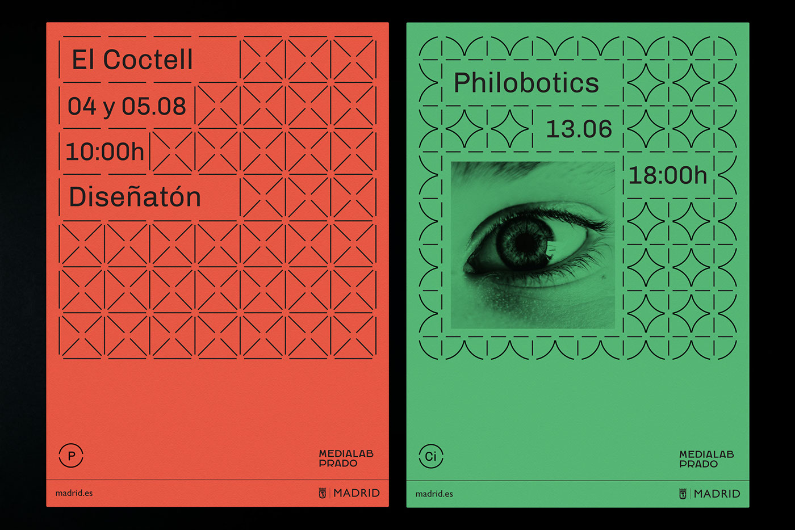
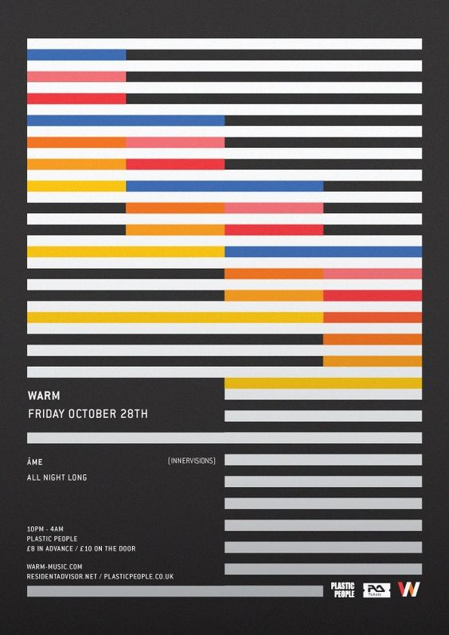

## Principes

### Choisir une image

**Banque d'image**

- Une image est choisi par le redacteur de l'article
- Une image est choisie automatiquement depuis une base de donnée suivant le principe “Premier résultat de la requête / J’ai de la chance” 
- Pour illustrer un article, une image est choisie en vue d'être retraité comme matière à un processus génératif
- Pour illustrer un article, un pictogramme est choisie aléatoirement depuis un répertoire restreint *(image 1)* 

**Aléatoire**

*Le caractère aléatoire peut être obtenu :
  - par la definition de valeurs aleatoires (ex. Donne moi une nuage de rouge entre 0 et 100%) 
  - par la combinaison de motifs visuels issue d'un répertoire restreint*

Une image abstraite unique est généré suivant des règles programatiques
Elle est généré une fois pour toute à la rédaction de l'article et est stocké sous forme d'une image ou d'une valeur *(cf. corpus de donnés)*.
  
**Typographie**

- Aucune image n'est choisie, la hiérarchie typographique fait le travail.
- Un ou plusieurs mots sont choisis par le redacteur de l'article afin d'être mis en image. *(image 3 & 4)* 
 

***

## Cas concret et exemples visuels

*(image 1)*
Sur la [Chaire Art & Science](http://chaire-arts-sciences.org/category/actions/), chaque article est illustré par un pictogramme abstrait, lié à sa catégorie

*(image 2)* 
Sur le site [Low Tech Magazine](https://solar.lowtechmagazine.com/), les images sont volontairement dégradé en Bitmap afin de réduire leurs poids et de soulager le cout énergétique d'une requête serveur (celui-ci fonctionne sur batterie grâce à deux panneaux solaires)

*(image 3)* 
Exemple mêlant Trame, Typographie et densité. Peut être intéressant d'introduire le mot comme une image.

*(image 4)* 
Clin œil à la nature textuel des images numérique, ce [site](http://mkweb.bcgsc.ca/asciiart/) regorge d'exemple Ascii Art. L'utilisation de cette méthode peut être envisagé au sens plus pragmatique (mettre en échec un copyright ) comme le plus abstrait (Une image "J'ai de la chance" est choisie et devient prétexte à l'isolation d'une suite de caractère )

*(image 5)* 
Le Medialab du Prado utilise un système approchant pour son identité. Celui-ci ne fait pas fit des image pour autant.  [Voir le projet en détail](https://www.behance.net/gallery/50727421/Medialab-Prado)

*(image 6)* 
En 2006, l'institut Max Plank se dotait d'un logotype modulaire génératif avec un dégradé chromatique particulier. [Plus d'information](https://interaktivegestaltung.net/evolving-logo-2/)

*(image 7)* 
Exemple plus abstrait. Ici des jeux avec les formes répétitives de la musiques.

*(image 8)* 
Totalement diffèrent, jouer du flou et de l'imbrication de forme coloré pour témoigner du caractère osmotique, transdisciplinaire du Medialab.

